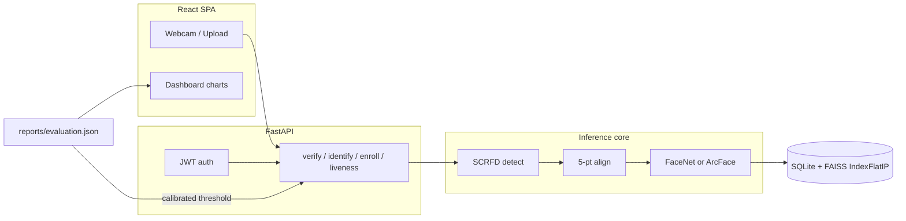

# Face Recognition System

FaceNet / ArcFace verification and identification for access control. Grounded in Schroff et al., *FaceNet: A Unified Embedding for Face Recognition and Clustering* (CVPR 2015), with an ArcFace classification head (Deng et al., CVPR 2019) used for fine-tuning.

Deliverables: trained face encoder, verification/identification API, TAR@FAR report, and a React + FastAPI app with liveness, JWT sessions, and an evaluation dashboard.

## Architecture



Pipeline: detect (SCRFD-10GF) → 5-point similarity-transform align → L2-normalised 512-D embedding → cosine score. The API refuses frames with no face, several faces, or a face that is too small / blurry.

Encoders:

- **FaceNet** — vendored Inception-ResNet-v1, published VGGFace2 weights (`weights/20180402-114759-vggface2.pt`).
- **ArcFace** — InsightFace `w600k_r50` ONNX, used as a published reference (not trained here).
- **FaceNet fine-tuned** — same backbone with an ArcFace head on a 402-identity VGGFace2 subset that has had LFW-overlapping identities removed.

The API serves whichever encoder wins TAR@FAR = 1e-3 on LFW View 2 (`reports/evaluation.json`). Override with `FRS_ENCODER`.

## Setup

Python 3.12, Node 20+, ~4 GB disk for LFW + the training subset + weights.

```bash
# backend
python3.12 -m venv .venv
source .venv/bin/activate
pip install -e ".[dev]"

# frontend
cd frontend && npm install && cd ..

cp .env.example .env
```

Weights download themselves on first use (FaceNet `.pt`, buffalo_l ONNX). If they are already under `weights/`, nothing is fetched.

## Data

```bash
python scripts/download_lfw.py
python scripts/download_vggface2_subset.py
python scripts/check_overlap.py          # writes data/excluded_identities.txt
python scripts/prepare_crops.py          # LFW memmap cache + aligned training tree
```

The VGGFace2 download already excludes LFW-overlapping identities. `data/train/` is a 402-identity / ~16k-image subset; `data/cache/lfw_crops_{160,112}.npy` is one detection pass over LFW so encoders are compared on identical geometry.

## Evaluation (TAR@FAR, LFW accuracy)

Standard LFW View 2: 10 folds × (300 genuine + 300 impostor) = 6,000 pairs. Threshold for 10-fold accuracy is picked on 9 folds and applied to the held-out fold. TAR is reported at FAR = 1e-2, 1e-3, 1e-4. The API operating point is TAR@FAR=1e-3.

```bash
python scripts/evaluate.py --encoders facenet arcface
# after fine-tuning:
python scripts/evaluate.py --encoders facenet --checkpoint checkpoints/facenet_arcface.pt --merge
```

Writes `reports/evaluation.json`, `reports/TAR_FAR_REPORT.md`, and ROC / score-distribution figures under `reports/figures/`.

## Training

```bash
python scripts/prepare_crops.py --train
python scripts/train.py --epochs 8 --batch-size 32
```

Early Inception-ResNet blocks stay frozen. The ArcFace head (`s=32`, `m=0.5` with a 2-epoch margin warmup) and later residual blocks are what move. Best checkpoint: `checkpoints/facenet_arcface.pt` (`{"backbone", "head"}`). With only 402 identities this run is expected to trail the published FaceNet weights on LFW — that gap is a reported result, not a silent failure.

## Run the app

```bash
# terminal 1 — API (SQLite by default)
source .venv/bin/activate
uvicorn app.main:app --app-dir backend --reload --port 8000

# terminal 2 — web
cd frontend && npm run dev
```

Open http://localhost:5173. Default operator: `admin` / `admin1234`. Vite proxies `/api` to port 8000.

**Postgres + PostGIS (geofence production path):**

```bash
# Choose a password once; compose refuses to start without it.
echo "POSTGRES_PASSWORD=$(openssl rand -hex 16)" >> .env
docker compose up -d postgres
# then set in .env, reusing the same password:
# FRS_DATABASE_URL=postgresql+psycopg://frs:<POSTGRES_PASSWORD>@127.0.0.1:5432/frs
alembic upgrade head
```

Geofence checks use PostGIS `ST_DWithin` when the extension is available; SQLite falls back to Haversine.

**LLM Assist (HR chat):** set `FRS_LLM_API_KEY` (OpenAI-compatible). Optional: `FRS_LLM_BASE_URL`, `FRS_LLM_MODEL`, `FRS_EMBED_MODEL`.

Screens: Today dashboard, people directory, face enrollment, employee check-in, **Assist** (natural-language attendance Q&A), entrance kiosk, TV board, reports, recognition lab (ROC, TAR@FAR, verify / identify / liveness).

## Product requirements

The workplace product (roles, journeys, geofence, kiosk, acceptance criteria) is documented here:

- [docs/PRD.md](docs/PRD.md) — source
- [docs/Sentinel-PRD.pdf](docs/Sentinel-PRD.pdf) — printable
- [docs/Sentinel-PRD.docx](docs/Sentinel-PRD.docx) — Word

## Tests

```bash
.venv/bin/pytest
.venv/bin/ruff check backend scripts
cd frontend && npm test && npm run build
```

API tests use a fake encoder so they do not load FaceNet/InsightFace.

## API (prefix `/api/v1`)

| Method | Path | Purpose |
|--------|------|---------|
| POST | `/auth/register` `/auth/login` | JWT session |
| GET | `/auth/me` | current operator |
| POST | `/verify` | two images → cosine, match, FAR=1e-3 threshold |
| POST | `/verify/person/{id}` | image vs enrolled centroid |
| POST | `/identify` | 1:N FAISS inner-product search |
| GET/POST/DELETE | `/persons` | gallery CRUD |
| POST | `/persons/{id}/enroll` | 1–5 face images |
| POST | `/assist/chat` | HR Assist Q&A (LLM + retrieval; needs `FRS_LLM_API_KEY`) |
| GET | `/assist/history` | Assist chat history |
| POST | `/liveness/challenge` `/liveness/check` | blink + texture PAD |
| GET | `/metrics` | evaluation.json for the dashboard |
| GET | `/events` | access log |
| GET | `/health` `/ready` | encoder, gallery size, thresholds |

## Project layout

```
backend/app/
  encoders/     FaceNet + ArcFace
  pipeline/     detect, align, embed, quality gates
  eval/         LFW protocol, ROC / TAR@FAR
  training/     ArcFace head, fine-tune loop
  gallery/      FAISS IndexFlatIP
  liveness/     blink EAR + texture cues
  api/          FastAPI routers
  db/           SQLModel (User, Person, FaceEmbedding, AccessEvent)
frontend/src/   React + Tailwind + Recharts dashboard
scripts/        download, overlap check, crop cache, evaluate, train
data/           LFW + VGGFace2 subset (gitignored)
weights/        published checkpoints (gitignored)
reports/        evaluation.json + TAR_FAR_REPORT.md
```

## Grading metrics

- **LFW accuracy** — 10-fold View 2 protocol, mean ± std.
- **TAR@FAR** — true-accept rate at FAR = 1e-2 / 1e-3 / 1e-4 on the same 6,000 pairs.
- **EER** — equal-error rate on the pooled scores.

All scores are cosine similarity of L2-normalised embeddings.
